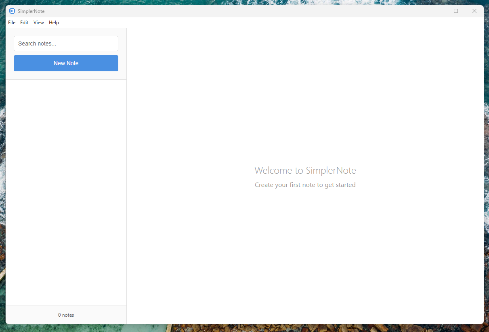

# SimplerNote

A clean, fast, and simple markdown note-taking application for Windows, built with Electron.



## Features

- **Markdown Support**: Full markdown editing with live preview
- **Three View Modes**: Edit, Split (edit + preview), and Preview-only
- **Local Storage**: All notes stored locally for privacy
- **Fast Search**: Search through note titles, content, and tags
- **Tagging System**: Organize notes with tags
- **Import/Export**: Support for .md and .txt files
- **Keyboard Shortcuts**: Efficient navigation and editing
- **Auto-save**: Never lose your work

## Download

[Download Latest Release](https://github.com/sestsom/simplernote/releases/latest)

## Keyboard Shortcuts

- `Ctrl+N` - New Note
- `Ctrl+S` - Save Note
- `Ctrl+E` - Export Note
- `Ctrl+F` - Search Notes
- `Ctrl+1` - Edit Mode
- `Ctrl+2` - Split Mode
- `Ctrl+3` - Preview Mode

## Development

### Prerequisites
- Node.js 16 or higher
- npm

### Setup
```bash
git clone https://github.com/sestsom/simplernote.git
cd simplernote
npm install
```

### Run Development Version
```bash
npm start
```

### Build for Distribution
```bash
npm run dist
```

## Supported Markdown

- Headers (`#`, `##`, `###`)
- **Bold** and *italic* text
- Lists (ordered and unordered)
- [Links](http://example.com)
- `Code` and code blocks
- > Blockquotes
- Tables
- Horizontal rules

## Privacy

SimplerNote stores all data locally on your machine. No data is ever sent to external servers, ensuring complete privacy of your notes.

## Contributing

1. Fork the repository
2. Create a feature branch (`git checkout -b feature/amazing-feature`)
3. Commit your changes (`git commit -m 'Add amazing feature'`)
4. Push to the branch (`git push origin feature/amazing-feature`)
5. Open a Pull Request

## License

This project is licensed under the MIT License - see the [LICENSE](LICENSE) file for details.

## Acknowledgments

- Built with [Electron](https://electronjs.org/)
- Markdown parsing by [Marked](https://marked.js.org/)
- Inspired by Automattic's Simplenote